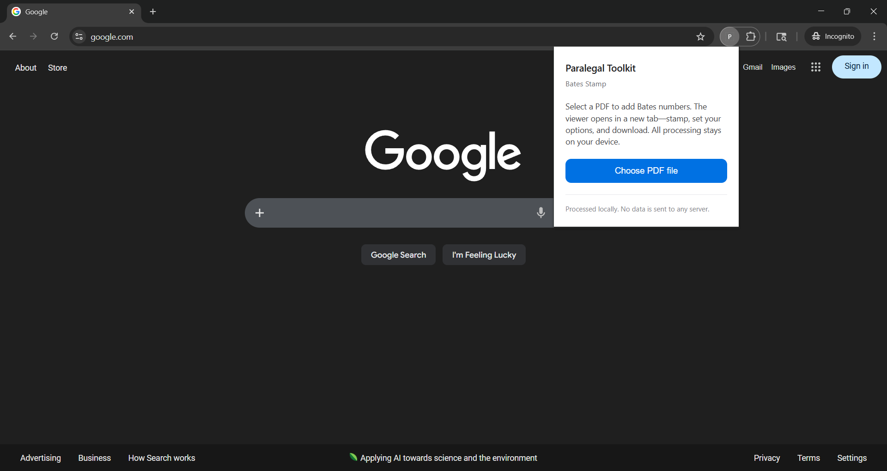
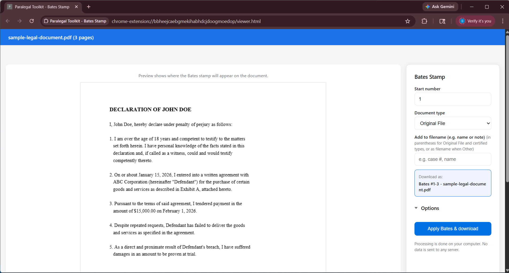
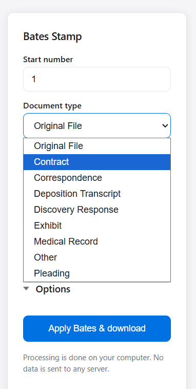
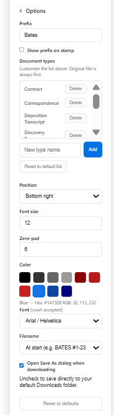
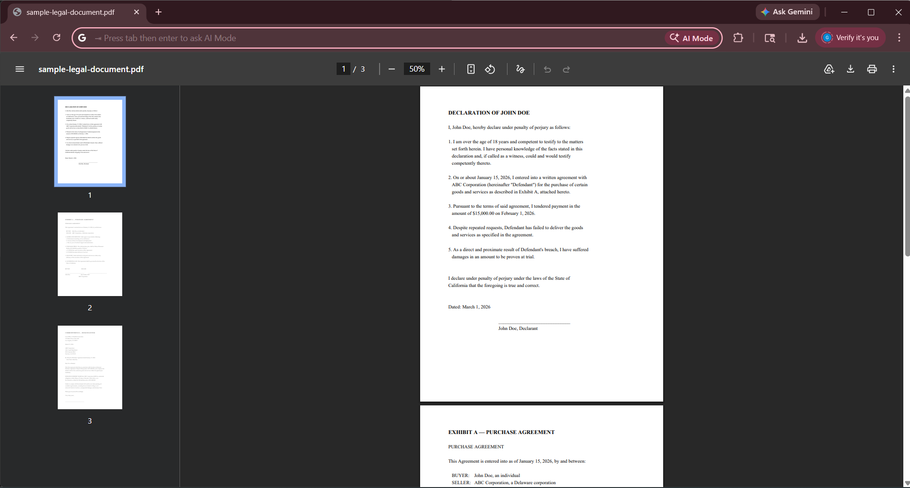
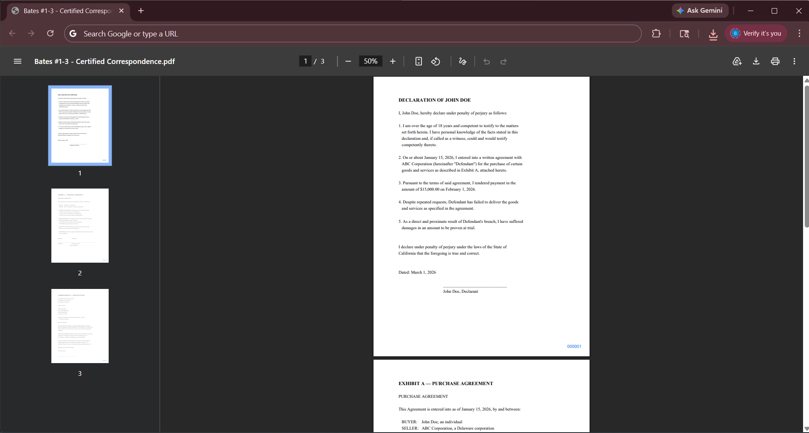

# Paralegal Toolkit


Paralegal Toolkit is a browser-based extension designed to streamline common litigation document workflows.

The initial release focuses on **automated Bates stamping** for PDF documents. Future modules will include secure redaction tools and additional document management utilities tailored for paralegals and litigation support professionals.

## Screenshots

**Extension popup** — select a PDF to get started.



**Viewer with live Bates stamp preview** — set your options and see the stamp placement in real time.



**Document types** — choose from built-in types or add your own.



**Stamping options** — prefix, position, font, color, zero-padding, filename format, and custom document types.



**Before and after** — original PDF vs. Bates-stamped output.

| Before | After |
|--------|-------|
|  |  |

## Chrome extension — Bates stamping

All processing runs on your computer; no PDF data is sent to any server.

### Build and load

1. From the project root:
   ```bash
   cd extension
   npm install
   npm run build
   ```
2. In Chrome: open `chrome://extensions` → turn on **Developer mode** → **Load unpacked** → choose the **`extension`** folder (the one that contains `manifest.json` and `viewer.html`).

**If you use the `extension/dist` folder** (smaller, for store upload): run `npm run package` from the `extension` folder, then load **`extension/dist`** in Chrome.

**Changes not showing?** After editing code you must:
1. Run **`npm run build`** from the `extension` folder (or `npm run package` if you load from `dist`).
2. In **chrome://extensions**, click the **Reload** button on your extension. Chrome does not auto-reload unpacked extensions.

### How to use

1. Click the extension icon.
2. **Choose PDF file** → select a PDF → **Open viewer**.
3. Set prefix, start number, position, font size, and zero-pad. Your last settings are saved for next time.
4. Use **Apply Bates & download** to generate the stamped PDF.  
   **Keyboard:** ← / → to change pages.

See `extension/README.md` for more detail and the local-only design.

## Current features

- Automated Bates numbering
- Custom prefix support
- Sequential numbering control
- Non-destructive output (generates a new file)
- Saved Bates preferences (prefix, position, etc.)
- Keyboard navigation (arrow keys) in the viewer

## Roadmap

- True content-level redaction (not visual overlays)
- Batch processing
- Court-ready export presets
- Audit log generation
- Chain-of-custody metadata options

## Why this exists

Bates stamping a PDF shouldn't require an expensive Adobe Acrobat subscription. This is a free, open-source alternative that runs entirely in your browser — no accounts, no subscriptions, no data leaving your machine.

## Author

[Lord Fernandez](https://www.linkedin.com/in/lordfernandez)
